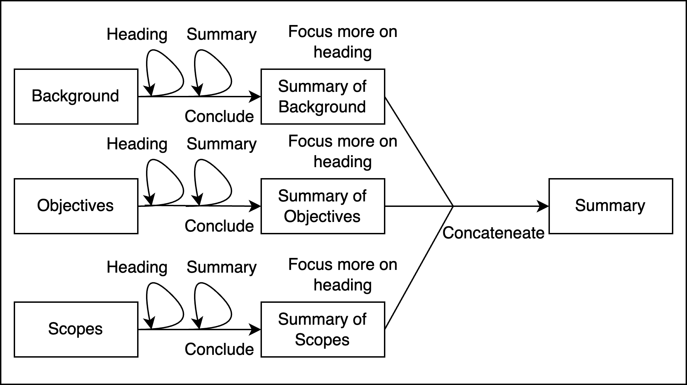
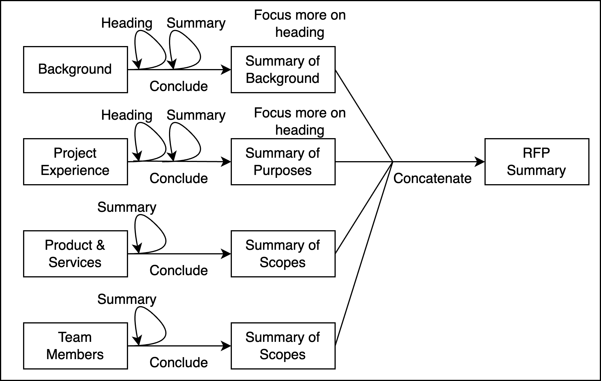
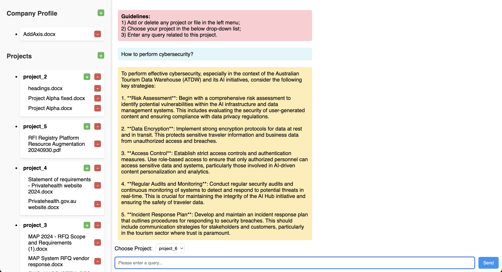
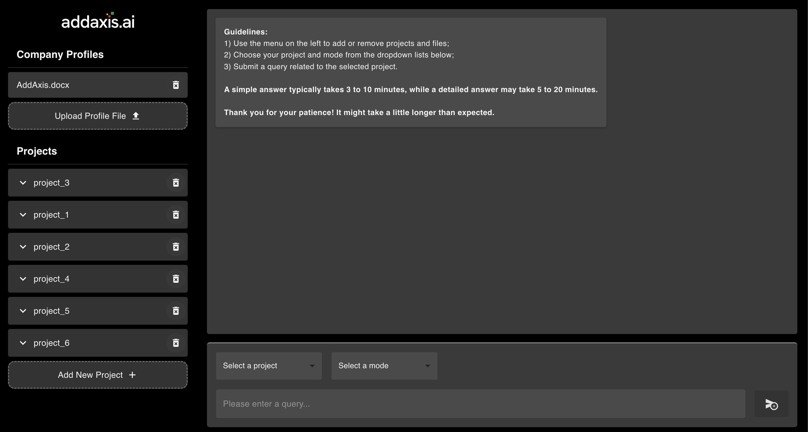
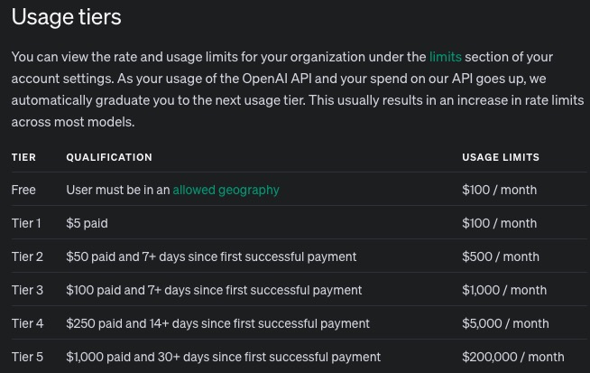
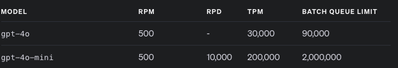
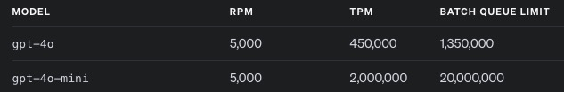
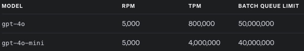
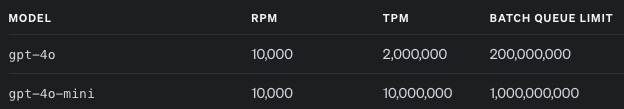

# **RFP_LLM**

The project aims to create a query-answering system for Request for Proposal (RFP). The system is designed to provide high-quality query-answers by leveraging the context of the RFP and the company profile. The system also includes a command-line chatbot that interacts with the query-answering system. In the future, the system may include features for generating complete proposals in response to RFPs. Additionally, the system can extract questions ending with a question mark and explore interesting topics from the RFP. The system also has a strong potential to streamline RFQ (Request for Quotation), RFI (Request for Information), RFT (Request for Tender), LOI (Letter of Intent), SOW (Statement of Work), EOI (Expression of Interest), ITT(Invitation to Tender).

## Website
- RFP_LLM (Powered by Django & React): http://13.236.191.152/

## **Table of Contents**
* [Background](#background)
* [Functionalities](#functionalities)
* [Accepted File Formats](#accpeted-files-formats)
* [System Features](#system-features)
* [Why not traditional method of LLM's query answering?](#why-not-traditional-method-of-llms-query-answering)
* [System Structure](#system-structure)
* [Tricky Points Recap](#tricky-points-recap)
* [Artifact Structure](#artifact-structure)
* [Usage](#usage)
* [Examples](#examples)
* [Version 0.2, (07-OCT-2024)](#version-02-07-oct-2024)
* [Version 0.3, (04-NOV-2024)](#version-03-04-nov-2024)
* [IMPORTANT: Usage Tier of OpenAI (28-JAN-2025)](#important-usage-tier-of-openai-28-jan-2025)
* [Future Directions](#future-directions)

## **Background**
Requests for Proposals (RFPs), similar to Requests for Quotations (RFQs), are documents issued by organizations to solicit bids for services or products. They outline requirements, expectations, and evaluation criteria for vendors. Used in industries like government, technology, and construction, RFPs are essential for complex projects. Automating the response process with a query-answering system can streamline efforts, reduce manual work, and improve the accuracy and relevance of proposals.

## **Functionalities**
- `Extract Questions and Topics:` Extracts relevant questions and topics for writing proposals.
- `Query Answering:` Answer query (or question) in the context of both RFP and company profile.
- `Chatbot Mode:` A chatbot designed to assist with ROP-related queries.

## **Accpeted Files Formats**

- The system supports the following file formats for both `RFPs` and `company profiles`: `.doc`, `.docx`,`.pdf`, `.txt`, `.xlsx`, `.xls`, `.csv`

Note: Additional formats may be supported in the future as required.

## **System Features**
- `Minimal human involvement:` The system is capable of transforming unstructured data into structured data (metrics) with minimal human involvement. The only required human action is to provide the file paths for the RFPs and company profiles.
- `Manage files in any length:` The system is designed to handle files of any length and extract information from them, regardless of their size. This is made possible by the system's ability to summarize information from individual chunks and then create a final summary by consolidating all the chunk summaries.
- `Supports mutliple industries:` The system is designed to support a variety of industries. The current framework is specifically built with flexibility in mind to accommodate this feature.
- `Supports multiple LLMs:` The system can support various LLMs, including ChatGPT, LLaMA, Gemini, and many others. This flexibility is made possible through the LangChain framework and the system's modular design.
- `Context-Aware Answering:` The system is able to deliver high-quality answers by leveraging the context of both the RFP and the company profile. This is achieved through the system's architecture and effective prompt engineering.

## **Why not traditional method of LLM's query answering？**
    
  The traditional method of query answering for RAG-LLM relies on chunking, vector stores, and retrievers. When a query is received, the system measures the semantic distance between the query and the available chunks. Then, the system retrieves multiple relevant chunks as context and inputs them into the LLM along with the query to generate an answer. The design of RAG effectively manages the token limits of LLMs, enabling the system to maximize the amount of context it can process while staying within the token limits.
  
  However, the traditional RAG method has its limitations. First, when dealing with very large documents, RAG may only provide an answer using specific chunks, making it incapable of handling documents of any length effectively. Second, retrieving only particular chunks provides a limited context, failing to capture a more general context that could improve the quality and completeness of the answer. Third, the quality of the answer heavily depends on how well the retrieved chunks match the query. If the most relevant context is not among the retrieved chunks, the generated answer may be incomplete or inaccurate.

  Our system aims to overcome the limitations of RAG. For chunk retrieval, we replace the traditional retriever with an LLM, using it to extract and compress the chunks iteratively. Our system leverages the LLM's capabilities in information retrieval, extraction, and compression, enabling it to provide context-aware answers while handling documents of any length with minimal human involvement. This forms the key advantage of our system.

## **System Structure**

- **Question Extraction**
  
  The system extracts questions ending with a question mark using Regular Expressions (Regex) and identifies interesting questions (topics) with the help of an LLM.

- **Query Answering**

  The system leverages both the local context and general context from the RFP document and the company profile when generating an answer. `Local context` refers to query-specific information, while `general context` refers to a broad overview or description of the entire document. 

- **Why general context?**
  
  When designing the structure of the system, we need to understand that "context is an abstract concept." It is difficult to expect a machine (LLM) to provide an exact output that aligns with what we have in mind. For example, when extracting information for a query like "How to perform cybersecurity?", we know that software is an important context to consider. However, an LLM typically extracts information that explicitly or semi-explicitly mentions cybersecurity, and therefore may fail to extract related information, such as software.

  It's important to recognize that as humans, we can identify the gap between the LLM's output and what we have in mind. To address this, we introduced the concept of "general context," which extracts broader information and provides a more comprehensive context for query-answering.  

- **What should be included in the general context?**

  - **Our focus should be on identifying which metrics can be omitted, rather than which ones should be included.**
    
    The general context should provide a broad overview of the RFP or company profile, serving as an essential supplement to the local context. It covers features common to all RFP documents rather than specific sections. `We should understand that the best general context is the summary of the entire document. Therefore, our focus should be on identifying which metrics can be omitted, rather than which ones should be included. Creating a summary of an abridged version of the document by removing unnecessary elements is more effective than simply summarizing the entire document. (Let's me explain this)` So when we conclude a general context for RFP, we first look at the structure of RFP. 
    
    Normally, the structure of an RFP consists of the following sections: 1) Project Overview 2) Scopes 3) Requirement 4) Specification 5) Budget, Pricing, Timeline 6) Evaluation Criteria 7) Terms and Conditions etc. So what information here can be omitted? Terms and Conditions are so specific. Evaluation Criteria may be also so specific. They can be removed.
    
  - **It may not be extracted from local context.**

    It is difficult to determine which information the LLM will extract and which it will not. Therefore, when selecting certain metrics, we should assess the likelihood of these metrics being extracted from the local context.

  - **It is not industry-specific.**
        
    Industry-specific information should not be included in the general context. For example, software and cloud platforms are important contexts in the AI or software industries, while the location of a mine is important in the mining industry. We are considering creating a section dedicated to industry-specific context. However, at present, industry-specific context is embedded within the general context.

- **Why Background, Objectives, Scopes? (For RFP general context)**
    
    Normally, the structure of an RFP consists of the following sections: 1) Project Overview 2) Scopes 3) Requirement 4) Specification 5) Budget, Pricing, Timeline 6) Evaluation Criteria 7) Terms and Conditions etc. We also noted that the sections may be varied for different RFP documents.

    We ultimately chose background, objectives, and scopes. (Budget, pricing, and timeline are used as examples or instances in the prompts for objectives.) When considering other sections like requirements, specifications, and evaluation criteria, we found them to be too specific and better suited for extraction by the local context. They do not meet the criteria mentioned above and are therefore not included in the general context. (Let's me explain this)

- **For company profile (general context)**
    
    Likewise as above.

- `Note: Please note that this is only a prototype system. Metrics may change as  gain a better understanding of both the documents in the process of devloping the system.`

- **RFP General Context**

    
  
  The RFP General Context is divided into 3 metrics: Background, Objectives, and Scopes. 
  - Each metric is summarized from individual chunks, and a final summary is created by consolidating all the chunk summaries. 
  - Each chunk is summarized `twice`. The first summary (`Heading` in above picture) is used to locate the exact metric in the RFP by identifying the relevant heading (Background, Objectives, Scopes) in the document (i.e. locating the paragraph with heading and make a summary of this paragraph). The second (`Summary` in above picture) is a general summarization of the chunk content.
  - Finally, we will create a prompt instructing the LLM to focus more on the sections identified by the relevant headings.
  - `Why Twice` for each chunk? We found that if we rely only on the first method (locating the heading), sometimes the exact heading doesn't exist in the RFP. For example, the background information might be found in the introduction section, and there may not be a specific "Background" section. On the other hand, if we use only the second method (general summarization), the LLM tends to give a broad summary for each subtopic without referring to the relevant section in the RFP. (Let's me explain this!) (See [./examples/why_twice.ipynb](./examples/why_twice.ipynb))

- **Company Profile General Context**
    
  The Company Profile General Context is divided into 4 metrics: Background, Project Experience, Product & Services, Team Members.

  -  Each metric is summarized from individual chunks, and a final summary is created by consolidating all the chunk summaries. (The same as RFP General Context)
  - Each chunk in background and project experience is summarized twice. The first summary (`Heading` in above picture) is used to locate the exact metric in the RFP by identifying the relevant heading (Background, Project Experience) in the document. The second (`Summary` in above picture) is a general summarization of the chunk content. (See ``why Twice`` above) 
  - The reason we summarize `Product & Service` and `Team Members` only once for each section is that they do not interweave with other sections or concepts. For example, Objectives and Scope are interwoven concepts because they share similar definitions. In contrast, the Product & Service and Team Members metrics show distinct characteristics. Therefore, we provide a summary for each section rather than placing the information under specific headlines. (Let's me explain this!)

## Tricky Points Recap
- `What should be included in the general context?`
    
  We should understand that the best general context is the summary of the entire document. Therefore, our focus should be on identifying which metrics can be omitted, rather than which ones should be included.

- `Why we summarize each chunk twice in RFP General Context?`

  The first approach is to locate the exact topic using headlines in the document, while the second is to create a general summary for each chunk. The first method fails to capture information that may not be associated with a headline (e.g. background in the introduction section), while the second tends to become too broad, rather than focusing on the paragrah with exact headlines. (e.g. background section in a RFP) These two methods complement each other, each compensating for the other's shortcomings. The first approach (heading) can focus more on describing the metric using its corresponding paragraphs in the document, while the second approach (summary) can extract the metric even without corresponding paragraphs in the document. (See [./examples/why_twice.ipynb](./examples/why_twice.ipynb))

- `Why we summarize once for some of the metrics in Company Profile General Context?`

  Not necessary needed to do it twice as above because they are distigushable metrics (e.g. Team members) rather than interwoven concepts (e.g. introduction & background; scopes & objectives). We only need to do it once (General chunking summary without locating the headline). Summarizing once can be more cost-effective.

## **Artifact Structure**
- `data/`: Store RFPs and company proflies
- [src/model_initializer.py](src/model_initializer.py): To experiment with different versions of LLM models.
- [src/prompt_and_chain.py](src/prompt_and_chain.py): For prompts and chains
- [src/text_splitter.py](src/text_splitter.py): To experiment with different versions of text splitters.
- [src/timer.py](src/timer.py): A timer for chatbot when executing query
- [src/utils.py](src/utils.py): Contains utility functions, including file reading and regex matching.
- [src/vectorstore_retriever.py](src/vectorstore_retriever.py)  *(Deprecated)*: Implements different vector store and retriving methods for retrieval.
- [Chatbot.py](Chatbot.py): The interface of the chatbot
- [config.py](config.py): Configuration of ROP paths and LLM keys
- [key.py](key.py): LLM keys *(.gitignore)*
- [RAG_chain.py](RAG_chain.py): Data preparation and query-answering chain (The Class that links everything together.)
- [main.py](main.py): Main function to execute functionalities

## **Usage**
- `LLM keys:` Put your LLM key(s) into `key.py`.
- `document path:` Put your RPF document(s) and company profile document(s) path into `config.py`.
- `main.py:` Create an instance of RAG_Chain.
- `Chatbot.py (optional):` Launch Chabot mode, put your instance of RAG_Chain into your instance of Chatbot.

## **Examples**
- Reference: [.examples/](./examples/)

## Time
The following estimation is based on GPT-4o-mini.

- `General Context:` Extracting the general context from both the RFP and the company profile takes about 3 to 10 minutes each, depending on the size of the document.
- `Simple Answer:` Providing a simple answer takes 10 seconds to 2 minutes, depending on the complexity of the query and the length of the document.
- `Detailed Answer:` An additional 5 to 10 minutes is required after generating the simple answer, depending on the complexity of the query and the size of the document. For very simple question, it takes less than 1 second.
- `Note:` Extracting the general context is a one-time operation. Therefore, for the first question, it takes longer compared to the subsequent questions because of the extraction process. After the first question, the general context is reused for the following questions.

## **Version 0.2, (07-OCT-2024)**
### New Features
- `RFP Background:` After testing with more RFPs, we extract the RFP background using a single summarization, without relying on locating its heading, for improved performance.
- `Answers with more details:` As we aim to stand out among a range of products with similar functionalities, we are adding this feature and providing more detailed answer. (The system can still produce simple answer. Detailed answering is only an option. Be careful, it takes additional 5-10 minutes for detailed answer. Simple answer requires only 0.5-2 minutes.)
   
  We now have the simple answer from our system. **(See [System Structure](#system-structure))** First, the LLM extracts a simple answer and converts it into JSON format. (The simple answer has many key points, and we aim to iterate each key point for more details.) Then, for each key point, we extract its local context from both the RFP and the company context using the LLM. Finally, the LLM generates a detailed answer for each point, and we concatenate all the answers for the key points. This produces a detailed answer for a query.

### Miscellaneous 
- `Company Profile:` The system's structure has proven effective with additional RFPs. However, the evaluation and improvement of company profile extraction still require further testing with more company profile documents.

## **Version 0.3.1, (04-NOV-2024)**
### New Features
- `Batch Inference:` We now use batch inference to reduce the time spent on each query. Specifically, `Langchain.RunnableParallel` is used for batch inference when extracting RFP or company documents, while asynchronous programming with the `asyncio` library and the `await` keyword enables parallel processing of subtasks (e.g., RFP background, objectives). Evidence has shown that batch inference saves at least five times the processing time; however, we need a Tier 2 account for further testing.

- `Frontend and Backend:` We have created a web page for this project using `Vue` for the frontend and `Django` for the backend. (http://13.236.191.152/)

### Webiste Layout
  

### Known Issues
- `Batch Inference:` We have currently disabled batch inference as it requires a Tier 2 account. A Tier 1 account has a limit of 200,000 TPM (tokens per minute), which is insufficient, while a Tier 2 account with 2,000,000 TPM provides adequate capacity.
- `Model Hallucination:` We have identified some instances of model hallucination in the system. For example, the system sometimes refers to personal experiences as company experiences. ([See Query 1](./examples/Version%200.2%20\(More%20Details）/project_6_AI_Hub.ipynb)) We are still researching how to manage hallucination.

## **Version 0.3.2, (18-NOV-2024)**
  - Update a Website Layout using `React` (Still http://13.236.191.152/)
  - Provide a contextual view for every answer.
  - Include a button to copy the answer.
  

## **Version 0.3.3, (28-JAN-2025)**
- Batch Inference is now available with my self-paying Tier 2 account.
  - **Simple Answer** with Query - "How to perform cybersecurity?"
    | Project        | Without Batch Inference | With Batch Inference        |
    |----------------|------------------------|--------------------------|
    | Project 5      | 367s  | 58s |
    | Project 6      | 308s  | 42s  |
  - **Detailed Answer** with Query - "How to perform cybersecurity?"
    | Project        | Without Batch Inference | With Batch Inference        |
    |----------------|------------------------|--------------------------|
    | Project 5      | 614s  | 206s |
    | Project 6      | 460s  | 187s  |
  - **`Notes: There is still potential to significantly reduce the time required to produce a detailed answer by using a Tier 3 account.`**

## **IMPORTANT: Usage Tier of OpenAI (28-JAN-2025)**
**Original Website:** https://platform.openai.com/docs/guides/rate-limits#usage-tiers

- **Usage tiers are OpenAI's rate limits for API access. It is crucial to leverage batch inference to reduce response times for queries. With a Tier 2 account, we can use batch inference to improve response times for Projects 5 and 6 due to their smaller word counts. However, conducting batch inference for other projects, such as Projects 1, 2, 3, and 4, is challenging because their larger word counts frequently exceed OpenAI's rate limits, disallowing us from utilizing their API.**
- RPM is requests per minute, and TPM is tokens per minutes. Here, we need TPM (tokens per minutes.)
- **We anticipate needing a Tier-4 account for our project, which allows up to 10 million tokens per minute. The current Tier-2 account, with a limit of 2 million tokens per minute, is insufficient. Upgrading to a Tier-4 account requires a $250 top-up in the account.**

- **Top-up**

  

- **Tier 1**

  
- **Tier 2**

  
- **Tier 3**

  
- **Tier 4**

  

## **Future Directions**
- ~~**Provides more details in the answer**~~

    ~~The system is now capable of giving a general answer that highlights key points. It is also possible to explore these key points in greater detail.~~ [Accomplished in Version 0.2](#version-02-07-oct-2024)

- ~~**Batch Inference**~~
    
    ~~One of the major issues before our product commercialization is the long wait time for receiving an answer. We are doing asynchronous context extraction by iterating each chunk and it is a waste of time. Some of the solutions include using threads or batch for synchronous context extraction.~~ [Accomplished in Version 0.3](#-version-03-04-nov-2024)

- **Manage files in any length**

    We're almost there, but there are still a few more steps to go before we can fully manage files of any length. Specifically, improvements are needed in the chunking summary process using a MapReduce method.

- **Industry-related Context** 

    Storing the industry-related context that demands to be extracted in the `./data/industry_context`. The system can extract industry-related context from RFPs or company profle with minimal human intervention.

- **Proposal Automation**

    Ultimately, we aim to achieve fully automated proposal writing. This should be developed based on the structure of the proposal and an exploration of serveral proposal templates.

## **Related Papers**
- [Tao el al. (2024)](./papers/LLM%20as%20Retriever.pdf)
highlight the limitations of retrieving information based on a single query, as queries are often short, general, and ambiguous in intent. Consequently, retrieving context solely from such queries—whether using embedding-based methods (e.g., BERT) or lexicon-based methods (e.g., BM25)—is inherently constrained. In order to capture boarder context, similar to the general context in our system, Tal et al. first enable the LLM to generate multiple answers using the same local context and query, then extract broader context based on the generated answers.
